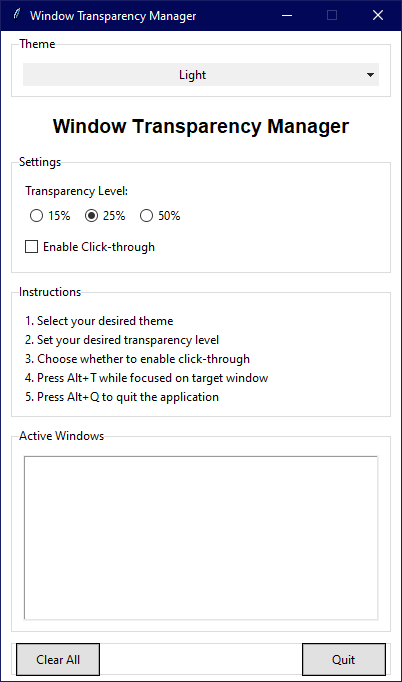
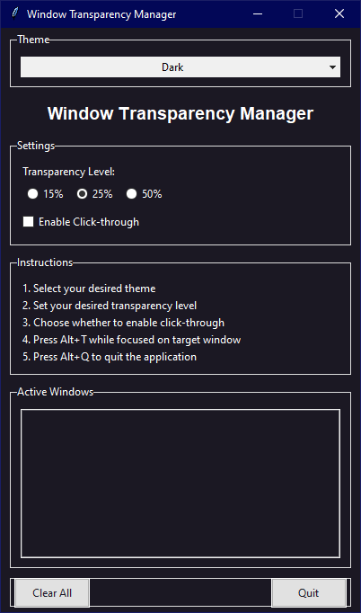
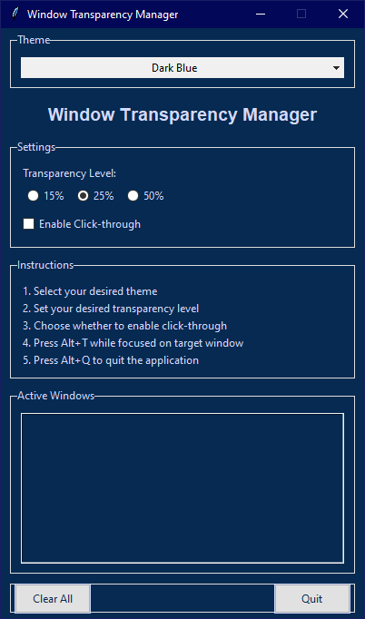
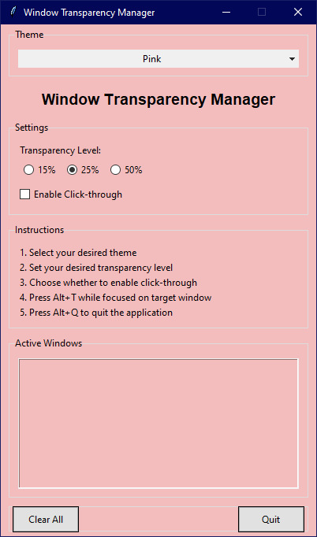
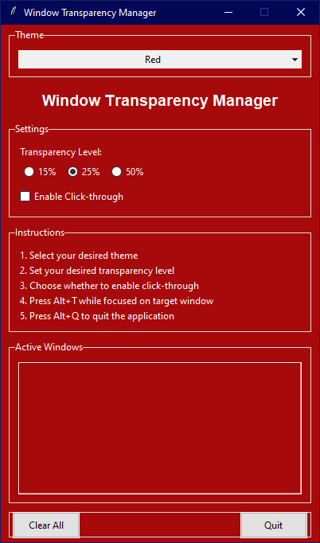

# Window Transparency Manager

A sleek and customizable tool to manage window transparency and click-through behavior in Windows. Perfect for streamers, multitaskers, and anyone who needs to see through or interact with overlapping windows.

## Available Themes

### Light Theme - Clean and Professional

### Dark Theme - Elegant Dark (#1B1823)

### Light Blue Theme - Soft Sky Blue (#ACC8E5)

### Dark Blue Theme - Deep Navy (#062A51)

### Pink Theme - Soft Rose (#F3BDBD)

### Red Theme - Bold Crimson (#A70A0A)

## Features

- **Beautiful Themes**: 
  - Light - Clean and professional white theme
  - Dark - Elegant dark theme (#1B1823)
  - Light Blue - Soft sky blue theme (#ACC8E5)
  - Dark Blue - Deep navy theme (#062A51)
  - Pink - Soft rose theme (#F3BDBD)
  - Red - Bold crimson theme (#A70A0A)

- **Window Transparency Control**: 
  - Choose from 15%, 25%, or 50% transparency levels
  - Apply transparency to any window with a simple hotkey

- **Click-Through Functionality**: 
  - Make windows click-through to interact with windows beneath
  - Perfect for keeping references visible while working

- **Easy Controls**:
  - Alt + T: Toggle effects on the focused window
  - Alt + Q: Quit the application

## Installation & Usage

1. Download `WindowTransparencyManager.exe`
2. Run the executable
3. Select your preferred theme from the dropdown menu
4. Choose your desired transparency level
5. Focus on any window and press Alt + T to apply effects
6. Press Alt + Q to quit when done

## Tips for Specific Applications

### Discord
- Great for keeping chat visible while gaming
- Recommended: 25% transparency without click-through
- Try the Dark Blue theme for a Discord-like experience

### YouTube Picture-in-Picture
- Perfect for floating video windows
- Recommended: 15% transparency with click-through enabled
- The Dark theme works great for video content

### Reference Materials
- Ideal for keeping documentation visible
- Recommended: 50% transparency without click-through
- Light Blue theme provides excellent readability

## Usage Tips

1. **For Discord Streams**:
   - Start a Discord stream
   - Pop out the stream window
   - Use Window Transparency Manager to make it semi-transparent

2. **For YouTube Videos**:
   - Open a YouTube video
   - Click the popout button
   - Apply transparency to watch while working

3. **General Use**:
   - Select transparency level first
   - Enable click-through if needed
   - Focus on target window
   - Press Alt+T to toggle effects
   - Use the GUI to see active windows
   - Click "Clear All" to restore all windows

## Keyboard Shortcuts

- `Alt+T`: Toggle effects on the focused window
- `Alt+Q`: Quit the application

## Limitations

- Works only on Windows
- Some applications may block window modifications
- Click-through mode may not work with all applications
- May require administrative privileges for some windows

## License

This project is licensed under the MIT License - see the LICENSE file for details.

## Acknowledgments

- Inspired by the need for better window management during streaming and multitasking
- Thanks to all users for their feedback and suggestions 